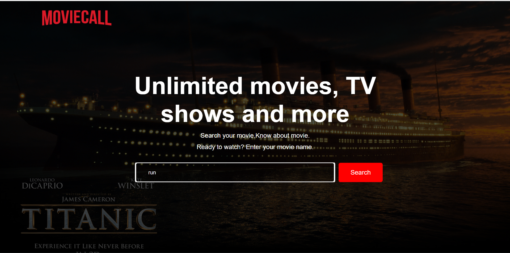
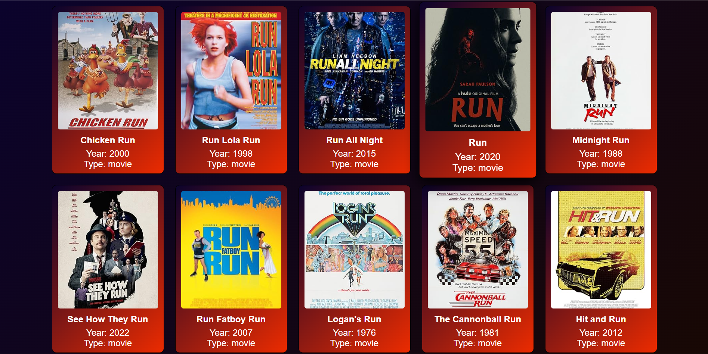
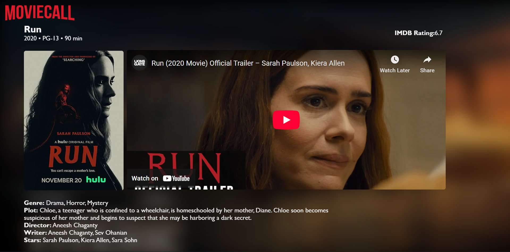

# MovieCall

MovieCall is a **frontend movie search and collection web app** built with **HTML, CSS, and JavaScript**. It integrates the **OMDB API** to fetch movie details and the **YouTube API** to display trailers. Users can search for movies, view details, and watch trailers in a **clean, responsive, Netflix-style interface**.

---

## 🌟 Features

- Search movies by name using **OMDB API**  
- View detailed information about movies (year, genre, plot, cast, ratings)  
- Watch trailers via **YouTube API** integration  
- Responsive design for desktop and mobile  
- Clean, modern Netflix-style UI  

---

## 📷 Screenshots

### Home Page

### Movie Details

### Trailer View

## 🖥️ Live Demo

Access the live version of MovieCall here:  
https://vpsrathod.github.io/Movie-Call/

---

## 📂 Project Structure
MovieCall/
│
├─ images/ # UI images, posters, screenshots
├─ config.js # Contains OMDB and YouTube API keys
├─ index.html # Main page (search interface)
├─ detail.html # Movie detail page
├─ style.css # Styles for main page
├─ dstyle.css # Styles for detail page
├─ README.md # Project documentation
└─ .gitignore # Ignored files 

## 💡 How It Works

1. User enters a movie name in the search bar.  
2. App fetches movie data from **OMDB API**.  
3. Detailed info is displayed on `detail.html`.  
4. Trailers are fetched from **YouTube API** and embedded dynamically.  

---

## 🎨 Future Improvements

- Add **user authentication** and personal watchlist  
- Enable **movie rating and reviews**  
- Add **category filters and sorting options**  
- Implement **dark mode / light mode toggle**  
- Integrate **infinite scrolling** for search results  

---

## 📜 License

This project is open-source and available under the **MIT License**.  

---

## 👨‍💻 Author

**Vishnu Pratap Singh Rajput**  
- GitHub: [vpsrathod](https://github.com/vpsrathod)  
- Portfolio: [yourportfolio.com](https://vpsrathod.github.io/)  

Made with ❤️ using **HTML, CSS, JavaScript, OMDB API, and YouTube API**